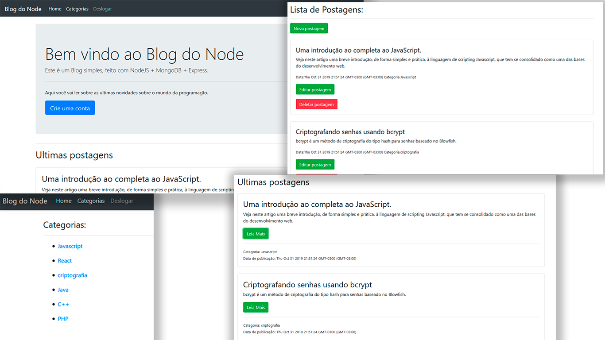

<h1 align="center"><br>
<br>
<br>


<h1 align="center">Projeto de estudo</h1>
<br/>
Projeto desenvolvido durante o curso de NodeJS do [Victor Lima - Guia do Programador](https://www.youtube.com/watch?v=LLqq6FemMNQ&list=PLJ_KhUnlXUPtbtLwaxxUxHqvcNQndmI4B).
<br/>
<h1 align="center">BlogApp</h1>
Um blog feito com NodeJS, Express, Handlebars e MongoDB. <br/>
Uma aplicação simples, todos os usuarios pode ler e filtar os posts por categorias, e apenas admins podem criar postagens e categorias. 


## Instalação
Clone este repositório e instale as dependências.
```sh
git clone https://github.com/rafaelsouz/blogapp.git
yarn
# ou
npm install
```
- No arquivo `config/db.js` incluir em `mongoURI` sua URL de conexão com o banco de dados **MongoDB**

### Para rodar
```
node app.js
```


